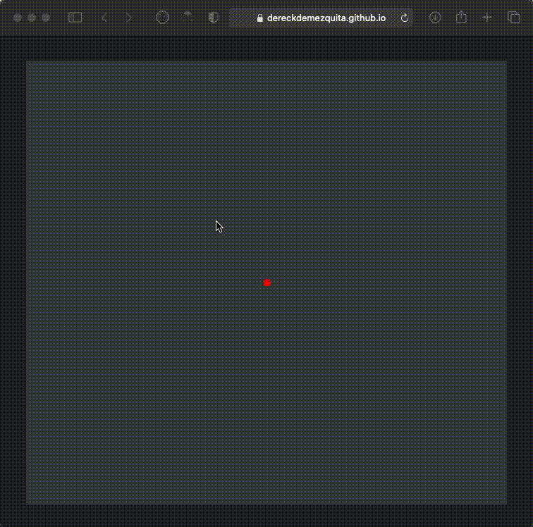

# ts-bouncy-balls

Demonstrating physics principles and laws in an interactive `canvas` bouncy ball physics simulation [^1].

Left click to shoot out one ball, right click to shoot out a continous stream of balls.

You can view the final interactive product of this project here: [dereckmezquita.github.io/ts-bouncy-balls/](https://dereckmezquita.github.io/ts-bouncy-balls/)

:warning: Loading gif :warning:

[^1]: related to [github.com/dereckmezquita/cpp-bouncy-balls][https://github.com/dereckmezquita/cpp-bouncy-balls] bouncy balls in `C++`.
